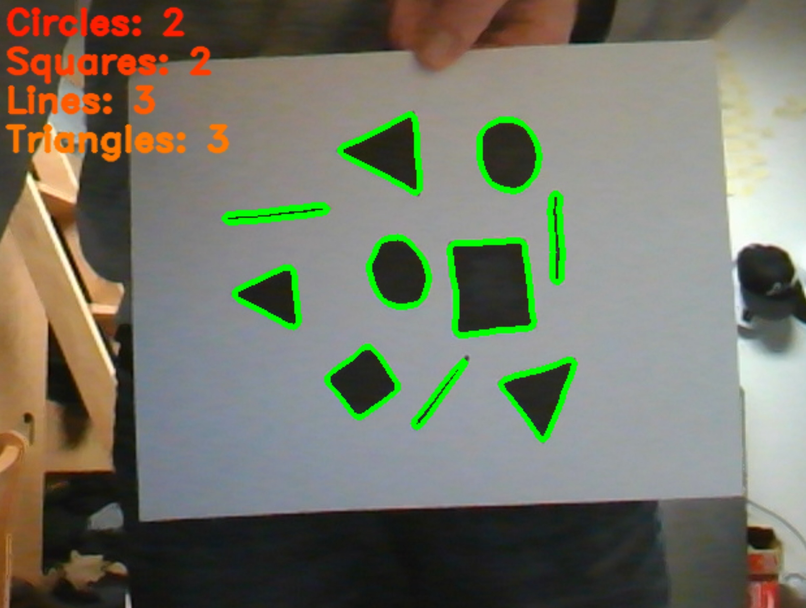

# ShapeIdentifier

## Developed to better understand contour identification 
Uses OpenCV for image recognition to identify and count the number of black circles, lines, squares, and triangles on a white background using the users webcam. Reduces noise and smoothes image through Gaussian blurring, detects and outlines edges, and detects the objects using contour identification.

## Installation

✔ Use python3.8~

✔ Run `cd ShapeIdentifier`

### Option 1:

✔ Install [pip](https://pip.pypa.io/en/stable/installing/)

✔ Run `pip install -r requirements.txt`

### Option 2:

✔ Install [pipenv](https://github.com/pypa/pipenv)

✔ Run `pipenv shell`

✔ Run `pipenv install`

## Running the App

- Make sure you have a webcam

- Run `python app.py`

- To close app press `q`

## Example

